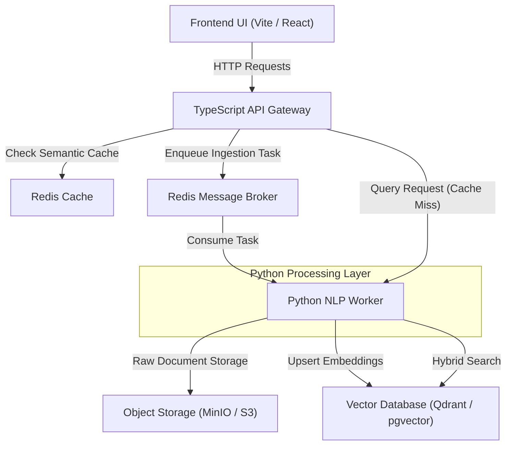
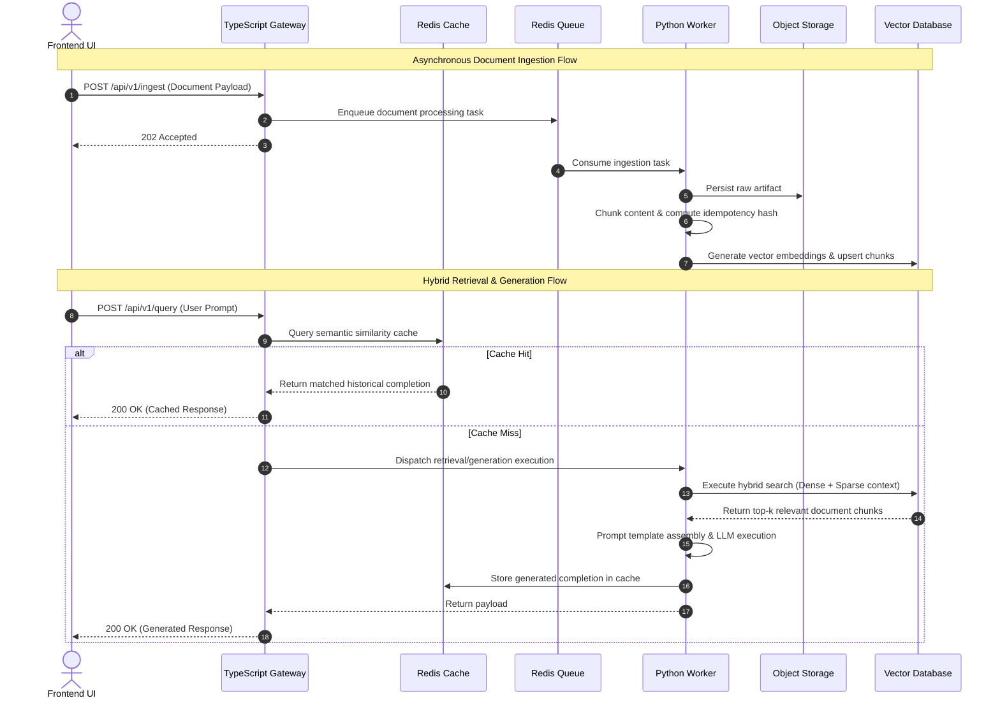

# CloudRAG

**Status: Work in Progress (WIP)**

CloudRAG is a modular, serverless, and cloud-agnostic Retrieval-Augmented Generation (RAG) orchestrator. Built with a polyglot architecture utilizing TypeScript and Python, it serves as a high-performance blueprint for deploying intelligent, data-driven services across any modern cloud provider without vendor lock-in.

---

## Architecture Overview

CloudRAG is designed around event-driven orchestration and clean separation of concerns. It decouples high-concurrency client interfaces and APIs from compute-intensive Natural Language Processing (NLP) workflows.



### Core Components

- **Frontend Layer:** Built with TypeScript, React, Vite, and `shadcn/ui` to provide an accessible, responsive, and highly polished user interface for document upload and knowledge querying.
- **Gateway Layer:** Implemented in TypeScript/Node.js to handle incoming connections, perform initial request validation, check semantic caches, and route ingestion tasks asynchronously.
- **Worker Layer:** Implemented in Python to handle intensive computational tasks, including document parsing, chunking, embedding generation, hybrid search execution, and LLM communication.
- **State & Storage:** Relies on cloud-agnostic containerized interfaces such as Redis for message queuing and caching, an OCI-compliant Vector Database for similarity search, and S3-compatible Object Storage for document persistence.

---

## Key Features

- **Intuitive User Interface:** Premium custom dashboard leveraging `shadcn/ui` and TailwindCSS for end-to-end RAG interaction and monitoring.
- **Asynchronous Orchestration:** Leverages Redis-backed message queues to offload long-running embedding tasks, providing immediate responses to clients during document ingestion.
- **Absolute Cloud Agnosticism:** Avoids proprietary serverless triggers or specific cloud provider implementations. Designed to deploy universally using Terraform and standard container runtimes.
- **Hybrid Retrieval Pipeline:** Combines dense vector similarity searches with sparse keyword-based retrieval (e.g., BM25) to maximize search relevance and context precision.
- **Semantic Caching:** Reduces overall response latency and third-party LLM inference costs by caching and reusing responses for semantically equivalent user queries.
- **Idempotent Ingestion:** Computes distinct cryptographic hashes for raw documents and segmented chunks to guarantee deduplication and prevent vector store pollution.
- **Polyglot Observability:** Implements comprehensive distributed tracing across TypeScript and Python microservice boundaries using OpenTelemetry.

---

## Tech Stack

| Component          | Technology                     | Description                                                  |
| :----------------- | :----------------------------- | :----------------------------------------------------------- |
| **Frontend UI**    | TypeScript, React, Vite        | Modern client dashboard utilizing `shadcn/ui` components     |
| **API Gateway**    | TypeScript, Node.js            | High-concurrency ingestion routing and API handling          |
| **Worker Engine**  | Python, LangChain / LlamaIndex | Document processing, embedding generation, LLM orchestration |
| **Message Broker** | Redis, BullMQ, Celery          | Event-driven task queuing and decoupled messaging            |
| **Vector Store**   | Qdrant / pgvector              | High-performance similarity and hybrid search                |
| **Object Storage** | MinIO / S3-compatible API      | Persistent layer for raw unstructured documents              |
| **Infrastructure** | Docker Compose, Terraform      | Local-first container orchestration and cloud-neutral IaC    |

---

## Project Structure

```tree
.
├── plans/
│   ├── intent.md          # Original project intent, vision, and core philosophy
│   └── overview.md        # Technical execution plan and blueprint overview
└── README.md              # Project documentation (this file)
```

> [!NOTE]  
> Code implementation directories (`frontend/`, `gateway/`, `workers/`, `infra/`) are currently planned and will be populated as development progresses.

---

## Logic Flows

The following sequence diagram outlines the system's primary execution paths for both asynchronous document ingestion and low-latency hybrid retrieval.



---

## Installation & Setup

Since the project operates on a local-first philosophy, the entire distributed architecture can be brought up locally using Docker Compose.

### Prerequisites

- [Docker](https://docs.docker.com/get-docker/) and Docker Compose installed.
- [Git](https://git-scm.com/) installed.

### Local Deployment

1. Clone the repository:

   ```bash
   git clone https://github.com/your-org/cloud-rag.git
   cd cloud-rag
   ```

2. Start the fully-orchestrated local environment:

   ```bash
   docker compose up --build -d
   ```

3. Verify service health metrics and standard open ports:
   - **Frontend UI:** `http://localhost:5173`
   - **API Gateway:** `http://localhost:3000`
   - **MinIO Console:** `http://localhost:9001`
   - **Vector DB Dashboard:** `http://localhost:6333`

---

## Usage Examples

### 1. Ingesting a Document via API

Submit an unstructured document to be processed asynchronously by the background workers.

```bash
curl -X POST http://localhost:3000/api/v1/ingest \
  -H "Content-Type: application/json" \
  -d '{
    "source_id": "doc-001",
    "content": "Retrieval-Augmented Generation bridges internal data sources with foundational LLMs."
  }'
```

**Response:**

```json
{
  "status": "queued",
  "task_id": "job_987654321",
  "message": "Document ingestion accepted for processing."
}
```

### 2. Querying the Knowledge Base via API

Execute a context-aware generation query utilizing the hybrid RAG architecture.

```bash
curl -X POST http://localhost:3000/api/v1/query \
  -H "Content-Type: application/json" \
  -d '{
    "prompt": "How does RAG utilize internal data sources?"
  }'
```

**Response:**

```json
{
  "answer": "Retrieval-Augmented Generation bridges internal data sources with foundational LLMs to provide relevant and specific context for generation.",
  "cached": false,
  "sources": ["doc-001"]
}
```
